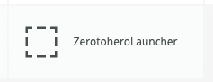
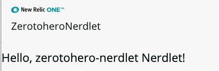

# Chapter 1 - Hello World

In this short chapter we learn how to create a nerdpack and get it running. This is covered by many other tutorials and workshops too. You may have already done this, if so move onto [Chapter-02](../chapter-02)


## 1. Get the tools

We assume that you already have the command line tools installed. If not, go to [one.newrelic.com](https://one.newrelic.com)  and download the installer by selecting "Build your own application". More help can be found in the [nr1 workshops.](https://github.com/newrelic/nr1-workshop/blob/master/SETUP.md)


**Please note:** This course uses a test account for example data, this means you must use an API key generated for an account you can access and you will need to adjust the NRQL queries used throughout the course to work with your account.


## 2. Create and test the application

From the terminal create a new nerdpack using the command line nr1 tool. 

```bash
nr1 create
```

Select `nerdpack` and provide a name. We'll be using the name `zerotohero` - you can use what you like but if you stick to this then the rest of the changes we make will be easier to follow. 

The tool should create the application and install the dependencies.

> ```bash
> ✔ What kind of component do you want to create? › nerdpack
> ✔ Name your component. … zerotohero
> Installing dependencies...
> npm notice created a lockfile as package-lock.json. You should commit this file.
> added 8 packages from 3 contributors and audited 27 packages in 1.263s
> found 0 vulnerabilities
> 
>  ✔  Component created successfully!
>     nerdpack zerotohero is available at "./zerotohero"
> ```

Now change directory to the newly created nerdpack and start the application using nr1:

```bash
cd zerotohero
nr1 nerdpack:serve
```


The tool should build your application and end with "`Nerdpack built successfully!`" 

Navigate to [https://one.newrelic.com/?nerdpacks=local](https://one.newrelic.com/?nerdpacks=local) in Chrome and you should see a new tile appears on the main screen with the title "Zerotoherolauncher":



Click this and you should now see the hello message. This is your app running:




>  If this is not working then something might be screwy with you setup. Review the instructions from the [nr1 workshop](https://github.com/newrelic/nr1-workshop) or [developer docs](https://developer.newrelic.com/build-tools/new-relic-one-applications/cli) for help.


----

[Continue to Chapter 2](../chapter-02)


**FEEDBACK!**

Please provide feedback about this chapter or the course in general via email (jbuchanan@newrelic.com) a **pull request** or via the [feedback form](https://forms.gle/STjad8z2YkdzwAWJA).

