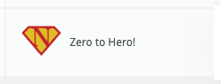
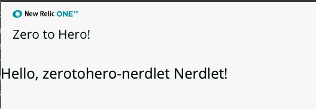
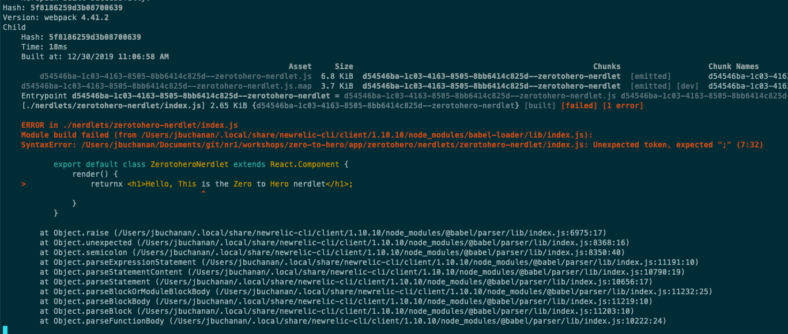

# Chapter 2 - Configure the App

In this chapter we customse the application appearance in the launcher, the nerdlet title, do some git configuration and finally take a look at how hot reloading works.


## 1. Customize the launcher

The launcher is the tile that appears on the NR1 home screen. Lets customise it to make it easier to find and use.

Open up the project in your [favourite code editor](https://code.visualstudio.com/) and navigate to the `/launchers/zerotohero-launcher` folder.

Edit the file `nr1.json`  by changing the **description** and **displayName** to suitable values like this:

```json
{
    "schemaType": "LAUNCHER",
    "id": "zerotohero-launcher",
    "description": "A nerdlet workshop",
    "displayName": "Zero to Hero!",
    "rootNerdletId": "zerotohero-nerdlet"
}
```

If you want to replace the icon used, change the `icon.png` image in this folder with your own square image (or use [ours](./screenshots/icon.png)). It is rendered at 48x48 pixels.

You may need to quit the nr1 app and restart it by pressing `CTRL-C` and then re-running `nr1 nerdpack:serve` This is because some file system changes can not be hot loaded.

Your tile should now look a bit like this:



## 2. Customise the Nerdlet title

The last thing to do is to set the title of our nerdlet. The nerdlet has been created in the `/nerdlets/zerotohero-nerdlet` folder. Navigate to this in your code editor and edit the `nr1.json` file to change the **displayName** and **description** fields:

```json
{
    "schemaType": "NERDLET",
    "id": "zerotohero-nerdlet",
    "displayName": "Zero to Hero!",
    "description": "This is a nerdlet!"
}
```





## 3. Configure `.gitignore`

If you want to manage your project in git (which you should) then its worth setting up the `.gitignore` file so that you are not sending unnecessary files to the remote repository.


In the root of the project create a file called `.gitignore` and add the following to it:

```bash
_site
**/.nos
**/.idea
**/dist
**/node_modules
**/coverage
**/tmp
**/.DS_Store
```

> This tells git to ignore all those folders/files. This means if you checkout the repo to a fresh location you would need to run `npm install` to re-install the node modules. Make sure you're creating your nerdlet in a fresh folder, not within an existing git managed folder.


Now initialise the git repo and commit:

```bash
git init
git add .gitignore
git add *
git commit -m "Initial commit"
```

> What does this do? If you are not familiar with git the fist line initialises the git repo in the current folder. Line 2 stages the .gitignore file and line 3 stages every other file (hidden files are not staged by default). The last line commits all the staged changes to the repo. [Learn more about Git](https://www.freecodecamp.org/news/learn-the-basics-of-git-in-under-10-minutes-da548267cc91/)


## 4. Hot reloading!

Now is a good time to demonstrate hot-reloading. When you make a change to the application the NR1 tool will attempt to hot-reload the change in the running browser window. Lets try this now by making a simple change to the application.

*Before we begin make sure that the application is being served (`nr1 nerdpack:serve`) and that you have the nerdlet open in Chrome.*

In the `/nerdlets/zerotohero-nerdlet` folder edit the `index.js` file and make the following changes:

1. Rename the class on line 5 from `ZerotoheroNerdletNerdlet` to `ZerotoheroNerdlet` or any other name you would like to choose. (i.e. remove the extra `"Nerdlet"` word from "`ZerotoheroNerdletNerdlet`" here). It seems when you create a nerdlet using the tool it goes a bit nerdlet crazy with the name of the class.   *(Note: this  step might be unnecessary if the bug in nr1 has been fixed)*

2. Change the return on line 7 to:

   ```jsx
   return <h1>Hello, This is the Zero to Hero nerdlet</h1>;
   ```


The full `index.js` file should now read:

```jsx
import React from 'react';

// https://docs.newrelic.com/docs/new-relic-programmable-platform-introduction

export default class ZerotoheroNerdlet extends React.Component {
    render() {
        return <h1>Hello, This is the Zero to Hero nerdlet</h1>;
    }
}

```


Save this file and observe the Chrome window auto update to show the changes. This is the hot loading in action. 

Its recommended to always keep a browser window open with your app allowing you to observe changes to the code as you make them.


### 5. Investigating hot-reload errors

You will frequently make mistakes and the hot-reloading will fail. It usually recovers once you fix the error. When an error does occur you can investigate it in two different locations: the terminal output (where nr1 is running) or in the browser inspector (in the console->errors pane).


Lets demonstrate this now by triggering an error. Intentionally break line 7 of the code in `index.js` by adding a typo to the word "return":

```jsx
returnx <h1>Hello, This is the Zero to Hero nerdlet</h1>;
```


You should see that the chrome brower reloads and then 'hangs' on the spinner. Open the inspector (`CMD+ALT+J`) and you can see the error in the errors pane:


Also look in the terminal window, you should see similar errors showing in the output. (You will see syntax/build errors but not runtime errors in the terminal):




Revert the `index.js` to the previous correct syntax and you should see the hot-reload pick ups the change and the nerdlet renders again without having to do anything else.


---

[Continue to Chapter 3](../chapter-03)


**FEEDBACK!**

Please provide feedback about this chapter or the course in general via email (jbuchanan@newrelic.com) a **pull request** or via the [feedback form](https://forms.gle/STjad8z2YkdzwAWJA).
