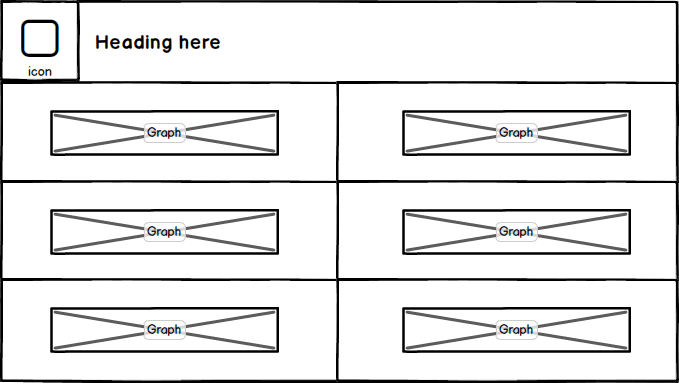
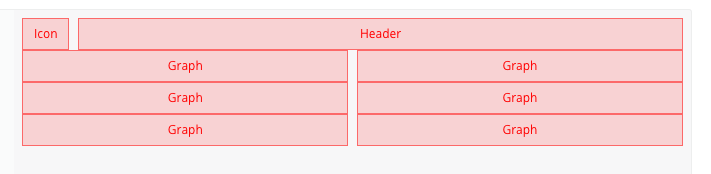
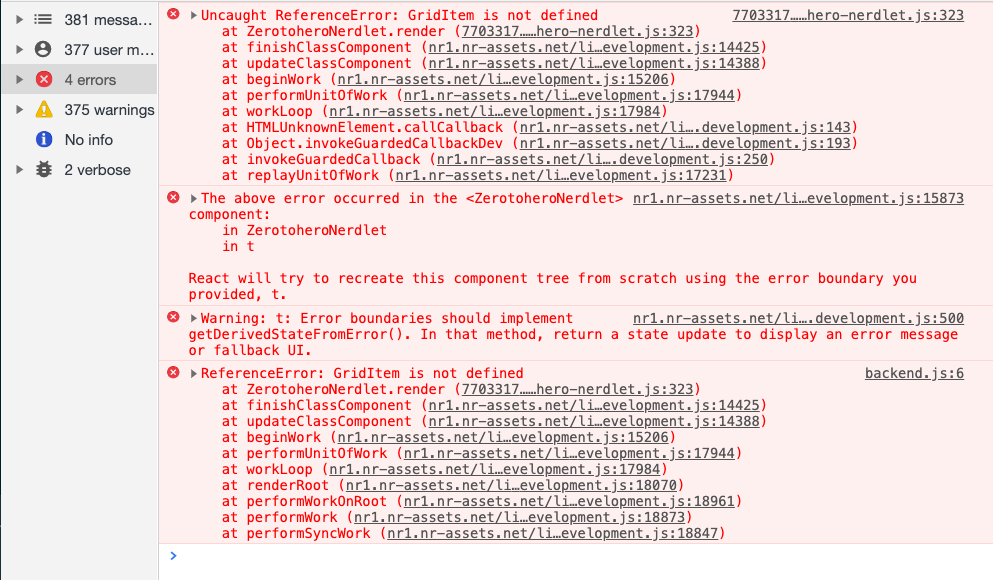
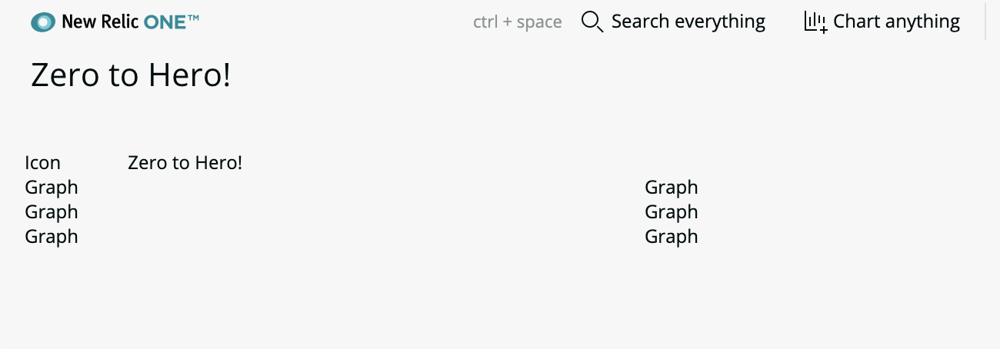

# Chapter 3 - Basic UI Layout

In this chapter we explore the NR1 API component documentation and use some of the components to build a simple layout for our application.


## 1. Explore the built in components

NR1 comes with a number of really great components that we can use out of the box to allow us to build our application UI. We'll go into more detail of what a component is (and build our own) later, but for now lets look at whats available.

Navigate to the [component documentation](https://developer.newrelic.com/client-side-sdk/index.html) area of the New Relic developer website. In the left hand navigation panel you should see a "UI Components" section. Find and select the **HeadingText** component. You will see that the documentation shows you how to import the component and then explains all the properties ("Props") you can specify for the component. 


**Testing code directly in the documentation**

Most of the components in the documentation have examples. You can edit these examples live in-place to test out the properties. Lets try this now.

Scroll down to the 'Examples' section of the HeadingText component documentation and change the element child text. You should see the rendered version of the code on the right change as you type.

Have a browse through all the other components to understand whats available and **be sure to bookmark this page as you will use it a lot!**


## 2. Design a Simple layout

For our example application we want to lay out our components using columns. New Relic provide some [starter layout templates](https://developer.newrelic.com/open-source/nerdpacks#Layouttemplates) to get you started quickly, but we'll build our own so that we can learn. Here is a rough sketch of what we're trying to achieve at this stage:





The component library offers a number of solutions to this. We will use the `<Grid>` component to build our UI. This component provides a 12 column layout, you can choose how wide each of your columns is within this. In our case the first row is 1 column wide for the icon and the other 11 columns for the title. The subsequent rows are 6 columns wide each.

Looking at the example in the documentation we can edit what is there to mockup what we want. Note that each `<Grid>` is a row and each `<GridItem>` is a column within. So here is our above mockup as component code:

```jsx
<>
    <Grid>
        <GridItem columnSpan={1}><div className="nr1-RedBox">Icon</div></GridItem>
        <GridItem columnSpan={11}><div className="nr1-RedBox">Header</div></GridItem>
    </Grid>
    <Grid>
        <GridItem columnSpan={6}><div className="nr1-RedBox">Graph</div></GridItem>
        <GridItem columnSpan={6}><div className="nr1-RedBox">Graph</div></GridItem>
    </Grid>
    <Grid>
        <GridItem columnSpan={6}><div className="nr1-RedBox">Graph</div></GridItem>
        <GridItem columnSpan={6}><div className="nr1-RedBox">Graph</div></GridItem>
    </Grid>    
    <Grid>
        <GridItem columnSpan={6}><div className="nr1-RedBox">Graph</div></GridItem>
        <GridItem columnSpan={6}><div className="nr1-RedBox">Graph</div></GridItem>
    </Grid>
</>
```


This is what it looks like:



Now we have a rough idea of the layout lets add it to our nerdlet.


## 3. Build the Layout

The code in the documenttion isnt exactly what we want, it includes some properties that make it easy to visualise on the examples demo but we want to build from scratch. Open up `/nerdlets/zerotohero-nerdlet/index.js` and add do the following:


**Import the component**

Components must be imported before they can be used. The docs show us what we need, for example `import { Grid } from 'nr1'`. 

Add an import for `<Grid>` to the top of the file like this:

```jsx
import React from 'react';
import { Grid } from 'nr1';
```


**Update the render method**

In the render() method replace the current return statement with the following. Note that we have removed the `<div className="nr1-RedBox">...</div>` within each `<GridItem>`. We have set the `columnSpan` property as per our design.

```jsx
        return <>
            <Grid>
                <GridItem columnSpan={1}>Icon</GridItem>
                <GridItem columnSpan={11}>Zero to Hero!</GridItem>
            </Grid>
            <Grid>
                <GridItem columnSpan={6}>Graph</GridItem>
                <GridItem columnSpan={6}>Graph</GridItem>
            </Grid>
            <Grid>
                <GridItem columnSpan={6}>Graph</GridItem>
                <GridItem columnSpan={6}>Graph</GridItem>
            </Grid>    
            <Grid>
                <GridItem columnSpan={6}>Graph</GridItem>
                <GridItem columnSpan={6}>Graph</GridItem>
            </Grid>
        </>
```


Save the changes. The application should hot-reload **but fail with an oops! message.**


We have made a mistake! A quick look at the terminal shows that the application built correctly (there are no errors shown) so the problem must be with the runtime code. Open the Chrome console inspector (`CMD+ALT+J`). You should see an error telling us that `GridItem` is not defined:




**We forgot to import the `<GridItem>` component.** Lets fix the code by amending the import statement at the top to import both Grid and GridItem:

```jsx
import { Grid, GridItem } from 'nr1';
```

The application should now hot-reload and display the grid as in the screenshot below. It is **very common to forget to import** components when you use them, especially when copy and pasting code. You now know what to look for and how to fix it!




---

[Continue to Chapter 4](../chapter-04)


**FEEDBACK!**

Please provide feedback about this chapter or the course in general via email (jbuchanan@newrelic.com) a **pull request** or via the [feedback form](https://forms.gle/STjad8z2YkdzwAWJA).