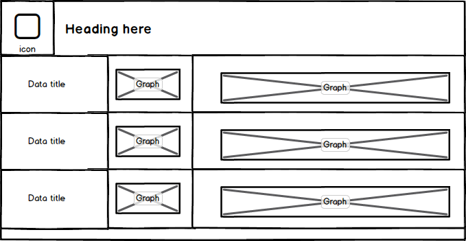
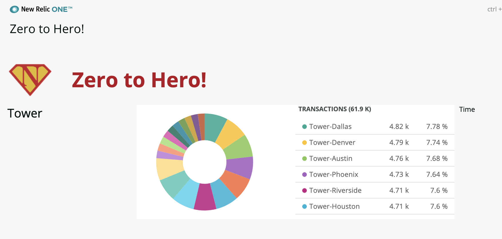
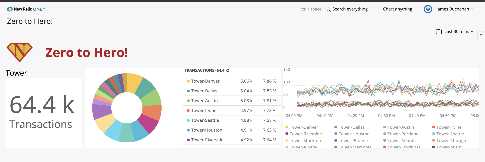

# Chapter 5 - Adding Charts

In this chapter we start using the chart components to bring data onto the page. We'll also explore using configuration to drive our data to avoid some verbose hard coding.

## 1. Displaying charts

The component library comes with lots of charts to help display our data. We'll be using the pie chart and line charts for now. Heres the mockup of where we're trying to get to:





### 1a. Amend the layout

First we need to adjust our layout to be three columns instead of two. Open up the `index.js` file and change the layout in the second row of the grid accordingly. For now I have reduced it to a single row for simplicity:

```jsx
<Grid>
    <GridItem columnSpan={2}>Duration</GridItem>
    <GridItem columnSpan={4}>Pie</GridItem>
    <GridItem columnSpan={6}>Time</GridItem>
</Grid>  
```


### 1b. Adding the Pie Chart

Take a look at the [documentation of the PieChart component](https://developer.newrelic.com/client-side-sdk/index.html#charts/PieChart). We'll use the Basic version for now where we supply a query and account ID/ Later we'll look at how to render charts from data. 

First import the PieChart component at the top of `index.js` :

```jsx
import { Grid, GridItem, HeadingText, PieChart } from 'nr1'
```

Copy in the basic example into the "Pie" `GridItem` in the code amending the **NRQL query** and **accountId** attributes as required for your account. For our example we'll use transactional data from our test account.

We have also amended the first column to use the HeadingText component:

```jsx
<Grid>
    <GridItem columnSpan={2}>
        <HeadingText tagType={HeadingText.TAG_TYPE.H2}>
            Tower
        </HeadingText>
    </GridItem>
    <GridItem columnSpan={5}>
        <PieChart
            accountId={1}
            query="select count(*) as 'Transactions' FROM Transaction where appName like 'Tower%' facet appName limit 100"
            fullWidth
        />
    </GridItem>
    <GridItem columnSpan={5}>Time</GridItem>
</Grid>  
```

> Notice that we have added an attribute  `fullWidth` to the `PieChart` component, this tells it to fill the entire horizontal space available.

You should now find the pie chart renders like the screenshot below. If you have trouble ensure the accountID is correct and that your NR1 profile is using the correct profile (`nr1 profiles:default`)

In some cases (especially if you see 403 errors in the inspector) it might be necessary to re-generate the UUID if it was generated for the wrong profile using `nr1 nerdpack:uuid -gf`. 





### 1c. Adding the Line Chart and Billboard

Add the [LineChart component](https://developer.newrelic.com/client-side-sdk/index.html#charts/LineChart) in the same way as the PieChart was added. It needs an account Id and query. Simply add the keyword timeseries to the query to make it render as a graph over time.

Also add the [Billboard component](https://developer.newrelic.com/client-side-sdk/index.html#charts/BillboardChart) under the title in the first column. This query is the same as the one in the pie chart by with the `facet` clause removed.

Finally add the attribute `fullHeight` and `fullWidth` to all three chart components to ensure they fill the entire height of the row.

***Remember to import the components at the top of the file!***

```jsx
import { Grid, GridItem, HeadingText, PieChart, LineChart, BillboardChart } from 'nr1'
```

```jsx
<Grid>
    <GridItem columnSpan={2}>
        <HeadingText tagType={HeadingText.TAG_TYPE.H2}>
            Tower
        </HeadingText>
        <BillboardChart
            accountId={1}
            query="select count(*) as 'Transactions' FROM Transaction where appName like 'Tower%'"
            fullWidth
        />
    </GridItem>
    <GridItem columnSpan={5}>
        <PieChart
            accountId={1}
            query="select count(*) as 'Transactions' FROM Transaction where appName like 'Tower%' facet appName limit max"
            fullWidth
            fullHeight
        />
    </GridItem>
    <GridItem columnSpan={5}>
        <LineChart
            accountId={1}
            query="select count(*) as 'Transactions' FROM Transaction where appName like 'Tower%' facet appName limit max timeseries"
            fullWidth
            fullHeight
        />
    </GridItem>
</Grid> 
```


Your application should be looking something like this now:




## 2. Simplifying a little with refactoring

The code works, but it contains rather a lot of repetitive information. For instance the account ID is repeated three times. To tidy this up we can move the data to variables or convert to a component. For now we'll just introduce some variables.

Create two constant variables just before the `return` but within the render() method. We'll store the **accountId** and the **appName** filter values here:

```jsx
...
render() {
    const accountId=1
    const appName="Tower"
    return <>
    ...
```


Now update the three places where `accountId` is referenced changing it from a hard coded number to the variable name:

```jsx
accountId={accountId}
```


Now change all the query attributes in the three charts from a string to ['template literals'](https://developer.mozilla.org/en-US/docs/Web/JavaScript/Reference/Template_literals). If you are not familiar with this then here is a quick example:

```jsx
let name="James"
let greeting=`Hello ${name}, would you like a pint?`
```

Essentially, you enclose the string with back ticks instead of single or double quotes, this then allows you to inject javascript directly using `${...}` syntax.


So, for each of our charts change the queries like this:

```jsx
query={"select count(*) as 'Transactions' FROM Transaction where appName like 'Tower%'"}
```

To:

```jsx
query={`select count(*) as 'Transactions' FROM Transaction where appName like '${appName}%'`}
```


Finally, we can also change the first column where the name of the app is displayed to use the variable.


Here is the full `render()` method:

```jsx
render() {
    const accountId=1
    const appName="Tower"
    return <>
        <Grid>
            <GridItem columnSpan={1}></GridItem>
            <GridItem columnSpan={11}>
                <HeadingText 
                    tagType={HeadingText.TAG_TYPE.H1}
                    className="MainHeading"
                >
                    Zero to Hero!
                </HeadingText>
            </GridItem>
        </Grid>
        <Grid>
            <GridItem columnSpan={2}>
                <HeadingText tagType={HeadingText.TAG_TYPE.H2}>
                    {appName}
                </HeadingText>
                <BillboardChart
                    accountId={accountId}
                    query={`select count(*) as 'Transactions' FROM Transaction where appName like '${appName}%'`}
                    fullWidth
                />
            </GridItem>
            <GridItem columnSpan={5}>
                <PieChart
                    accountId={accountId}
                    query={`select count(*) as 'Transactions' FROM Transaction where appName like '${appName}%' facet appName limit max`}
                    fullWidth
                    fullHeight
                />
            </GridItem>
            <GridItem columnSpan={5}>
                <LineChart
                    accountId={accountId}
                    query={`select count(*) as 'Transactions' FROM Transaction where appName like '${appName}%' facet appName limit max timeseries`}
                    fullWidth
                    fullHeight
                />
            </GridItem>
        </Grid>  
    </>
}
```


Your app should render exactly like before! 

---

[Continue to Chapter 6](../chapter-06)


**FEEDBACK!**

Please provide feedback about this chapter or the course in general via email (jbuchanan@newrelic.com) a **pull request** or via the [feedback form](https://forms.gle/STjad8z2YkdzwAWJA).