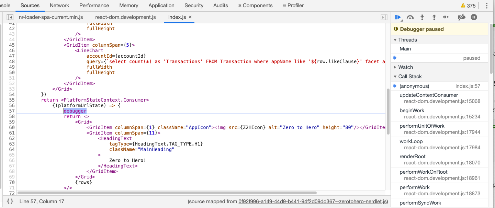
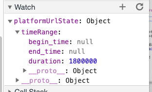
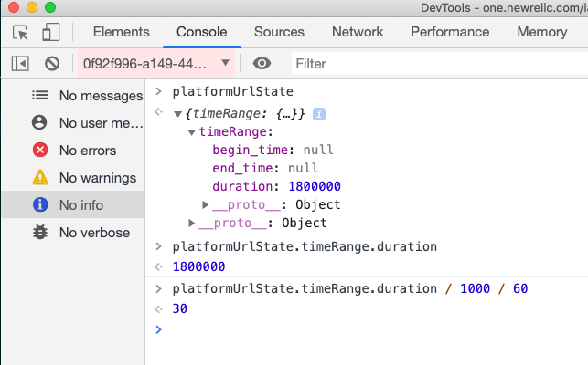
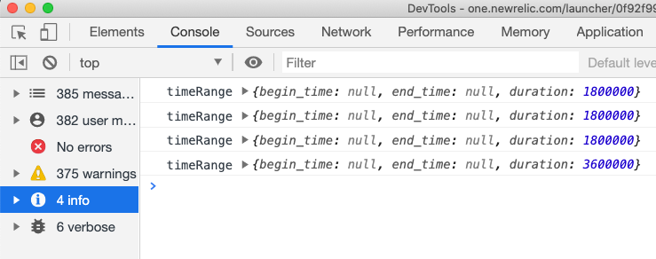

# Chapter 7 - Connecting up the time picker

In this chapter we connect our charts to the time picker, and use it as an excuse to explore the Chrome debugger tools.

 

## 1. Add `<PlatformStateContext.Consumer>`

Oh my, what a name for a component!

A quick look in the [docs](https://developer.newrelic.com/client-side-sdk/index.html#apis/PlatformStateContext) doesn't really tell us much either. Essentially this is the component that provides us data about the current context of the nerdlet, such as time frame selected. 


Add the component to the import line at the top of the script:

```jsx
import { Grid, GridItem, HeadingText, PieChart, LineChart, BillboardChart, Icon, PlatformStateContext } from 'nr1'
```


Now, we will need to wrap everything that was in our `return` block with this component. Simplified this is like this:

```jsx
return <PlatformStateContext.Consumer>
    {(platformUrlState) => {
    	...Original return code here...
    }}
</PlatformStateContext.Consumer>
```

> Take special notice of the double braces! This is an example of a declarative component syntax. Essentially it means that the variable `platformUrlState` will now be available to us wihtin our code block.


So add it to your code, your entire return statement should now look like this:

```jsx
return <PlatformStateContext.Consumer>
    {(platformUrlState) => {
        return <>
            <Grid>
                <GridItem columnSpan={1} className="AppIcon"></GridItem>
                <GridItem columnSpan={11}>
                    <HeadingText 
                        tagType={HeadingText.TAG_TYPE.H1}
                        className="MainHeading"
                    >
                        Zero to Hero!
                    </HeadingText>
                </GridItem>
            </Grid>
            {rows}
        </>
    }}
</PlatformStateContext.Consumer>
```


Save and test to make sure the app isnt broken. *You did remember to import the component didnt you?*


## 2. Use Chrome inspector to investigate

We will use this as an excuse to use a variety of Chrome debugger tools to investigate how the component changes with user interaction. Add the keyword `debugger` to the code immediately before the inner return statement:

```jsx
return <PlatformStateContext.Consumer>
    {(platformUrlState) => {
        debugger
        return <>
            <Grid>...
```


Now when the app loads it will pause at this point. The inspector should look like this with the row and word "debugger" highlighted: 



> If this is not what you see then reload the page, sometimes it doesnt work right first time


### 2a. Using a Watch

On the right hand column you should see the "Watch" section. Open this up and click the `+` icon and enter the variable name `platformUrlState`. This will now show you the value of the variable. Open up the timeRange attribute by clicking on the arrow:



Assuming you have "Last 30 mins" selected int the time picker you should see this object has a value of **1800000** in the **duration** field. 

Click the ⏯ play/pause button to allow the code to run again. The app should continue where it left off and render normally. Now change the time frame to something else such as "Last 12 hours". You should see the debugger stops again and the **duration** value has changed to anopther number (43200000).

Click the ⏯ play/pause button again and now choose a further time from the selector but this time choose a custom time frame. You will see this time the **duration** field is null but the **begin_time** and **end_time** are now populated.


### 2b. Using the console

Switch back to "Last 30 minutes". Whilst the debugger is paused, switch to the console tab of the inspector. Enter the text `platformUrlState` in the main window next to the blue chevron and press return. You will see that that variable value is displayed just like it was in the watch.

Now enter the following in the console:

```jsx
platformUrlState.timeRange.duration
```

> `1800000`

This returns the duration attribute only. This looks like it might be in milliseconds. Lets confirm that by dividing it by 1000 to get seconds and then 60 to get minutes:

```jsx
platformUrlState.timeRange.duration / 1000 / 60
```

> `30`


This is what it looks like in the console:




### 2c. Using `console.log()` and `console.debug()`

Replace the `debugger` line in the code with the following:

```jsx
console.debug("platformUrlState",platformUrlState)
console.log("timeRange",platformUrlState.timeRange)
```

Now when the app loads it doesnt pause, but data now appears in the console of the Chrome inspector. This makes it easier to look at data that changes over time.

Note that `console.debug()` will appear in the **"Verbose"** pane and `console.log()` will appear in the **"Info"** pane:




## 3. Implementing the time picker

We have learnt above how to inspect the value of the `platformUrlState` variable and now understand how it changes when the user interacts with it. We can summarise our findings thus:

- *"Last"* time periods populate the `timeRange.duration` field
- *"Custom"* time periods populate the `timeRange.begin_time` and `timeRange.end_time` fields with [unix timestamps](https://currentmillis.com/)
- Duration figures are in milliseconds

We need to add a since clause to each of our queries for our charts. Currently they all are defaulting to last 60 minutes. We need to do something slightly different for *last* vs *custom*:

For ***last*** we can simply add since clause like this:

```jsx
... since ${durationInMilliseconds / 1000} minutes ago
```

For ***custom*** we need a slightly different clause. As it happens NRQL supports [unix timestamps](https://currentmillis.com/) natively so no maths here:

```jsx
... since ${begin_time} until ${end_time}
```


### 3a. Move the logic so its within context

Currently the variable `rows` is defined before the `<PlatformStateContext.Consumer>` is invoked. This means that we cant access the time picker values. So lets move the logic so it sits within the `<PlatformStateContext.Consumer>` instead:

```jsx
return <PlatformStateContext.Consumer>
    {(platformUrlState) => {
        console.log("timeRange",platformUrlState.timeRange)
        const rows = appConfig.map((row,index)=>{
            return <Grid key={index} className="ChartRow">
                <GridItem columnSpan={2}>
                    <HeadingText tagType={HeadingText.TAG_TYPE.H2}>
                        <Icon sizeType={Icon.SIZE_TYPE.LARGE} type={row.icon} /> {row.name}
                    </HeadingText>
                    <BillboardChart 
                        accountId={accountId}
                        query={`select count(*) as 'Transactions' FROM Transaction where appName like '${row.likeClause}'`}
                        fullWidth
                    />
                </GridItem>
                <GridItem columnSpan={5}>
                    <PieChart
                        accountId={accountId}
                        query={`select count(*) as 'Transactions' FROM Transaction where appName like '${row.likeClause}' facet appName limit max`}
                        fullWidth
                        fullHeight
                    />
                </GridItem>
                <GridItem columnSpan={5}>
                    <LineChart
                        accountId={accountId}
                        query={`select count(*) as 'Transactions' FROM Transaction where appName like '${row.likeClause}' facet appName limit max timeseries`}
                        fullWidth
                        fullHeight
                    />
                </GridItem>
            </Grid>  
        })
        return <>
            <Grid>
                <GridItem columnSpan={1} className="AppIcon"></GridItem>
                <GridItem columnSpan={11}>
                    <HeadingText 
                        tagType={HeadingText.TAG_TYPE.H1}
                        className="MainHeading"
                    >
                        Zero to Hero!
                    </HeadingText>
                </GridItem>
            </Grid>
            {rows}
        </>
    }}
</PlatformStateContext.Consumer>
```

> Check everything is still working after this change!


### 3b. Add the since clause logic

Add some code to set the **sinceClause** variable based on the values of `platformUrlState` variable. Add it just before where `rows` is defined:

```jsx
let sinceClause = ""
if(platformUrlState && platformUrlState.timeRange) {
    if(platformUrlState.timeRange.duration) {
        sinceClause = `since ${platformUrlState.timeRange.duration/1000/60} minutes ago`
    } else if(platformUrlState.timeRange.begin_time && platformUrlState.timeRange.end_time){
        sinceClause = `since ${platformUrlState.timeRange.begin_time} until ${platformUrlState.timeRange.end_time}`
    }
}
```

> Read though this code carefully and ensure you understand how it works and how it relates back to our understanding of the `platformUrlState` variable.
>
> Notice how we defenisively code ensuring that variables exist before using them, this is to stop our app crashing if variables dont happen to exist for some reason.


Now add the **sinceClause** variable to the end of each query:

```jsx
const rows = appConfig.map((row,index)=>{
    return <Grid key={index} className="ChartRow">
        <GridItem columnSpan={2}>
            <HeadingText tagType={HeadingText.TAG_TYPE.H2}>
                <Icon sizeType={Icon.SIZE_TYPE.LARGE} type={row.icon} /> {row.name}
            </HeadingText>
            <BillboardChart 
                accountId={accountId}
                query={`select count(*) as 'Transactions' FROM Transaction where appName like '${row.likeClause}' ${sinceClause}`}
                fullWidth
            />
        </GridItem>
        <GridItem columnSpan={5}>
            <PieChart
                accountId={accountId}
                query={`select count(*) as 'Transactions' FROM Transaction where appName like '${row.likeClause}' facet appName limit max ${sinceClause}`}
                fullWidth
                fullHeight
            />
        </GridItem>
        <GridItem columnSpan={5}>
            <LineChart
                accountId={accountId}
                query={`select count(*) as 'Transactions' FROM Transaction where appName like '${row.likeClause}' facet appName limit max timeseries ${sinceClause}`}
                fullWidth
                fullHeight
            />
        </GridItem>
    </Grid>  
})
```


Test the application, you should find that it responds correctly to changes to the time picker. If not then use the debug tools to see where things may have gone wrong.


---

[Continue to Chapter 8](../chapter-08)


**FEEDBACK!**

Please provide feedback about this chapter or the course in general via email (jbuchanan@newrelic.com) a **pull request** or via the [feedback form](https://forms.gle/STjad8z2YkdzwAWJA).