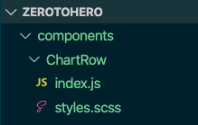
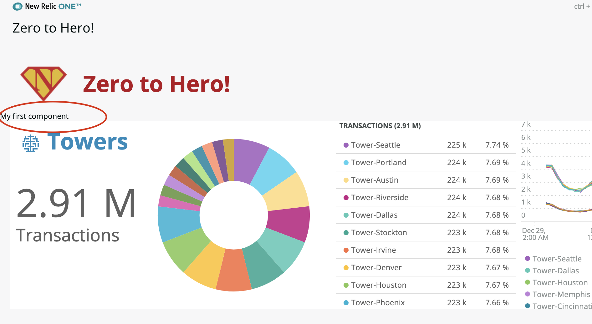
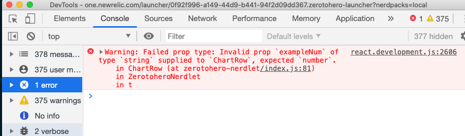

# Chapter 8 - Creating your own components

In this chapter we'll create our own components and wire them up to the application. We will learn what "props" and "state" are and practice using them. We also cover some property validation with PropTypes.


## 1. A simple component

We will start with a simple component and then apply what we have learnt to refactor the chart rows section into its own component.


### 1a. Create the component

In the root of the project create a folder called `components` (this isnt strictly necessary but I just do this to keep things tidy). Within that create another folder called `ChartRow` and create two empty files within that folder called `index.js` and `styles.scss`.




We will be creating a component called `ChartRow`. In the empty `index.js` file add the following code:

```jsx
import { Component } from 'react';

export default class ChartRow extends Component { 
    render() {
        return <div>My first component</div>
    }
}
```

> This is the most basic component possible. Components must have a `render()` method.


In the main `index.js` import this new component by adding a new import line at the top:

```jsx
import ChartRow from '../../components/ChartRow'
```


Now add our component `<ChartRow />`to the return block of the `render()` method, just before where `{rows}` is added:

```jsx
return <>
    <Grid>
        <GridItem columnSpan={1} className="AppIcon"></GridItem>
        <GridItem columnSpan={11}>
            <HeadingText 
                tagType={HeadingText.TAG_TYPE.H1}
                className="MainHeading"
            >
                Zero to Hero!
            </HeadingText>
        </GridItem>
    </Grid>
    <ChartRow />
    {rows}
</>
```


Save all the files and you should see the component is rendering before the charts:




### 1b. Connect up the style sheets

Its good to keep the styles for a component with the component code. Here we add some styling and link it up so that its nice and tidy.

Add the following styles to the empty `styles.scss` file within the ChartRow component folder:

```css
.example { color: red; }
```


Update the component code in `index.js` so that the `className` attribute is set on the `<div>`:

```jsx
return <div className="example">My first component</div>
```


If you save the files and view the app in Chrome you will see nothing has changed, the styles havent been picked up. We need to import the styles into the primary style sheet. Edit the `styles.scss` file within the `/nerdlets/zerotoheor-nerdlet` folder and add to the very top the following scss import:

```css
@import '../../components/ChartRow/styles.scss';
```

Now when you save the file you should see the styles are working and the component text is red.


## 2. Properties ("props")

React components can receive properties. We've already sent properties to components in our code whenever we have supplied an attribute. For example **columnSpan** is a property begin passed to this component (it has a value of 11):

```jsx
<GridItem columnSpan={11}>...</GridItem>
```

All the properties passed to a component when it is declared are added to a single object called `props`. We access this within our component by referencing `this.props`

> More about React properties can be found on the [React website](https://reactjs.org/docs/components-and-props.html)


### 2a. Receiving properties

Lets try this out with our ChartRow component. In the main nerdlet `index.js` file add an attribute called `example` to the component:

```jsx
<ChartRow example="This is some example text"/>
```


In the `index.js` of the ChartRow component change the inner content of the `<div>` like this:

```jsx
return <div className="example">{this.props.example}</div>
```


Save all the files, you should now see the component is rendering the text passed through the `example` attribute (aka "prop").


### 1b. Property Destructuring

Sometimes we need to use a property a lot. One convention that is popular is to assign all the required properties to a variables by [destructuring](https://www.deadcoderising.com/2017-03-28-es6-destructuring-an-elegant-way-of-extracting-data-from-arrays-and-objects-in-javascript/) at the begining of the code block. You will see this a lot and its good to understand whats happening.

Change the render method of the component to the following:

```jsx
render() {
    const { example } = this.props
    return <div className="example">{example}</div>
}
```

You can see that a constant variable has been created called `example` and is assigned automatically the value of `this.props.example`. Just like in the import statement we can extract as many variables as we want like this in a single line, for example:

```jsx
const { example, anotherExample, beer, chips, kittens } = this.props
```

> Note that this technique is often used with `state` too which we come onto later.


### 1c. Validating properties with `PropTypes`

Now is a good time to mention [PropTypes](https://www.npmjs.com/package/prop-types). Out of the box there is no validation available for properties. For components that see a lot of re-use its a good idea to help developers understand the type of properties expected. The PropTypes extension lets us do that. 

> This is only required to improve the stability and reliability of your code. I think its a good thing to include on all components.


In the main nerdlet `index.js` code add an additional couple of attributes to the component:

```jsx
<ChartRow example="This is some example text" exampleStr="This should be a string" exampleNum="This should be a number"/>
```


In the `index.js` of the ChartRow component add the following import:

```jsx
import PropTypes from 'prop-types';
```


In the class definition of `index.js` add right at the top the following `propTypes` static:

```jsx
export default class ChartRow extends Component { 
    static propTypes = {
        example: PropTypes.string.isRequired,
        exampleStr: PropTypes.string,
        exampleNum: PropTypes.number.isRequired
    }
    ...
```

> This defines that three of the properties we expect must conform to the rules. example and exampleStr must be strings, example must be provided but exampleStr could be omitted. We also define that exampleNum should be a number and must be supplied.


Save the files and the application should reload OK. However if you look in the inspector console in Chrome you should see an error now appears:




This error is showing because one of the properties we supplied, **exampleNum**, was a string but our configuration specifies it must be a number and is required. Lets fix it by changing the attribute to a number instead of a string:

```jsx
<ChartRow example="This is some example text" exampleStr="This should be a string" exampleNum={1}/>
```


Now you know how to use PropTypes, whether you choose to or not is up to you!


## 3. State

`state` is just like `props` but completely different! 😉 Here is how React describe it:

> [`props`](https://reactjs.org/docs/components-and-props.html) (short for “properties”) and [`state`](https://reactjs.org/docs/state-and-lifecycle.html) are both plain JavaScript objects. While both hold information that influences the output of render, they are different in one important way: `props` get passed *to* the component (similar to function parameters) whereas `state` is managed *within* the component (similar to variables declared within a function). [-- React Docs](https://reactjs.org/docs/faq-state.html)

The important thing about state to remember is that when state changes, the component responds by re-rendering. Put another way: **React components react to changes in state**.

What does this mean?! Well, what it means is that when you first load a component (called "mounting" in React) it renders based upon the properties its been given, but after that it only re-renders whenever its state changes. 


### 3a. Setting state example

Lets add some state to our component, it won't do much but the boiler plate code is useful. It will increment a counter each time we click on the component:

Beneath the definition of propTypes add the following constructor code:

```jsx
constructor(props) {
    super(props)
    this.state = { counter: 1 }
}
```

> This constuctor is only run when the component is first created. The first line calls any constuctors in the object hierachy (dont worry about it, just be sure to include it!), the second line sets the **state** of the component to an object that has a single attribute **counter** and sets its initial value to 1.


Change the render method so that the counter is retrieved from the state object (using destructuring)  and display it in the render:

```jsx
render() {
    const { counter } = this.state
    const { example } = this.props
    return <div className="example">{example}, counter: {counter}</div>
}
```

Save the file and you should see the counter currently has a value of one.


Now lets add a click handler to the component, which when clicked causes the counter to be incremented. Just before the `return` add define the following method:

```jsx
const incCounter = () => {
    this.setState({counter: counter+1})
}
```

> This method simply takes the current value of counter and increments it by one. The [`setState()`](https://reactjs.org/docs/faq-state.html) method is a special React method that all components have. Do not set `this.state` manually!


Add the click handler function to the `<div>` by suppling the `onClick` attribute:

```jsx
return <div onClick={incCounter} className="example">{example}, counter: {counter}</div>
```


Save the files and you should observe that now when you click on the component text the counter increments. We didnt have to do anything other than change the state. Changeing the state caused the component to re-render with the new values. Cool huh!


Here is the full code for the ChartRow component:

```jsx
import { Component } from 'react';
import PropTypes from 'prop-types';

export default class ChartRow extends Component { 
    static propTypes = {
        example: PropTypes.string.isRequired,
        exampleStr: PropTypes.string,
        exampleNum: PropTypes.number.isRequired
    }

    constructor(props) {
        super(props)
        this.state = { counter: 1 }
    }

    render() {
        const { counter } = this.state
        const { example } = this.props

        const incCounter = () => {
            this.setState({counter: counter+1})
        }

        return <div onClick={incCounter} className="example">{example}, counter: {counter}</div>
    }
}
```


---

[Continue to Chapter 9](../chapter-09)


**FEEDBACK!**

Please provide feedback about this chapter or the course in general via email (jbuchanan@newrelic.com) a **pull request** or via the [feedback form](https://forms.gle/STjad8z2YkdzwAWJA).