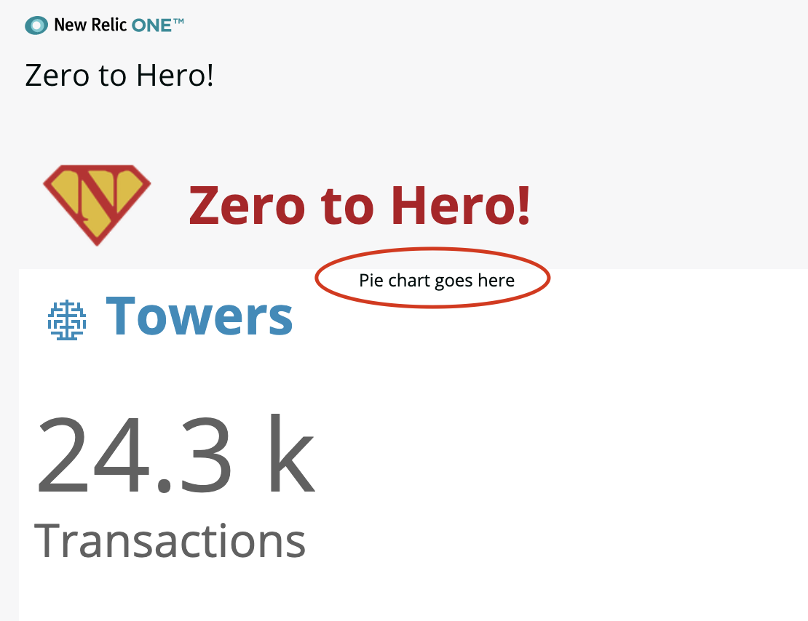
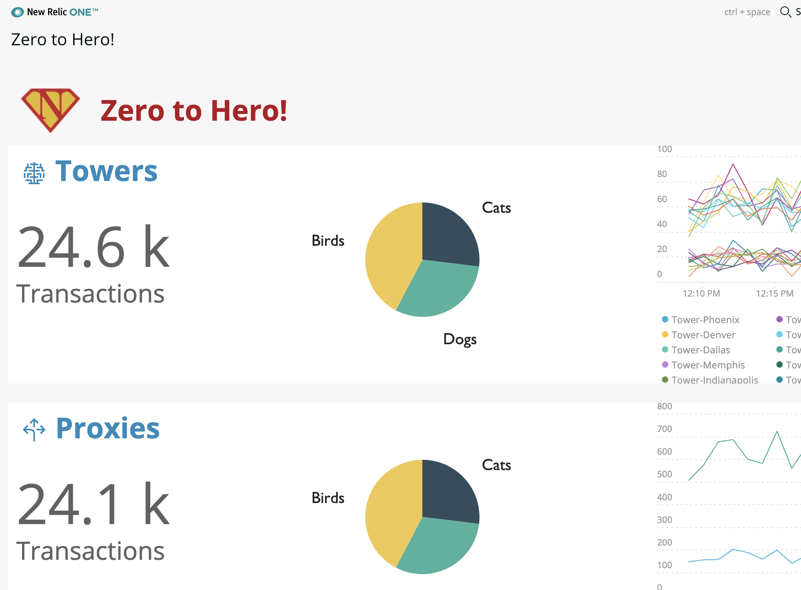

# Chapter 10 - Third party components 

In this chapter we have a go at using thrid party React libraries to supplement our application.


## 1. Installing an NPM node module

As an example we are going to change how the pie chart in our application is rendered . We will instead use a third party charting library called [Victory](https://formidable.com/open-source/victory/) to render the chart instead of the NR1 PieChart.

>  If you can get them to work, you can use any node library you can find. For example the [Leaflet maps](https://react-leaflet.js.org/) library is great  for displaying and annotating maps (there is a [lab workshop](https://github.com/newrelic/nr1-workshop/blob/master/lab8/INSTRUCTIONS.md) for that). 

First we need to install the npm module and save it to our package.json as a dependency. Run this in the root of your application:

```bash
npm install --save victory
```

Thats it!


## 2. Create the `SimplePie` component

We'll create our own component to hold the new pie chart. Lets get it up and running before integrating the Victory pie chart component.

Create a new file `SimplePie.js` in the `/components/ChartRow/` folder and add the following boiler plate code:

```jsx
import { Component } from 'react';

export default class SimplePie extends Component { 
    render() {
        return <div>Pie chart goes here</div>
    }
}
```

We need to import and reference this new component in our ChartRow component. Add a new import line under all the others in `index.js`:

```jsx
import SimplePie from './SimplePie.js'
```

> Notice that we specify the file name here. If you put an index.js file in a folder and reference it by the folder name React will automatically assume you need to import the index.js so there is no need to be specific.


Change the second `<GridItem>`, remove all the code that is there and replace with the `SimplePie` component:

```jsx
<GridItem columnSpan={5} >
    <SimplePie />
</GridItem>
```


Save the changes, you should now see the pie chart has gone replaced by some text:




## 3. Render the pie chart

Let start with an example pie chart with hard coded data. The [victory documentation](https://formidable.com/open-source/victory/docs/victory-pie/) gives plenty of examples. 

Add the import for the Victory library in `SimplePie.js` :

```jsx
import { VictoryPie } from 'victory'
```


Replace the `render()` method with the following:

```jsx
render() {
    return <VictoryPie height={200} colorScale="qualitative" 
        data={[
            { x: "Cats", y: 35 },
            { x: "Dogs", y: 40 },
            { x: "Birds", y: 55 }
        ]}
    />
}
```


Save the files and you should see that a pie chart renders on each row:




We'll populate this chart with our own data in the next chapter.


---

[Continue to Chapter 11](../chapter-11)


**FEEDBACK!**

Please provide feedback about this chapter or the course in general via email (jbuchanan@newrelic.com) a **pull request** or via the [feedback form](https://forms.gle/STjad8z2YkdzwAWJA).