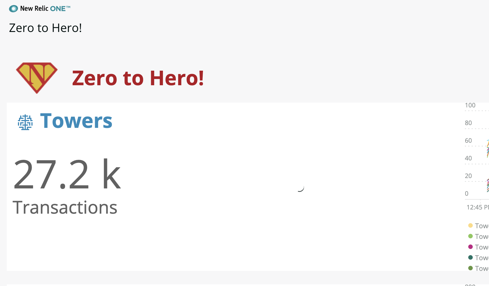
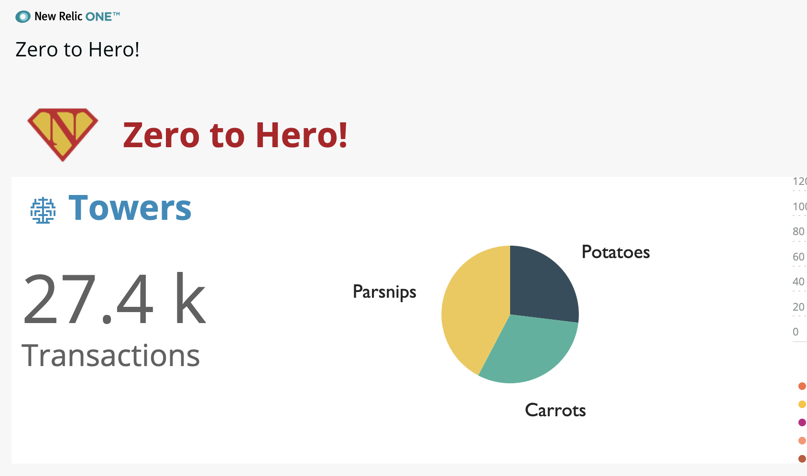
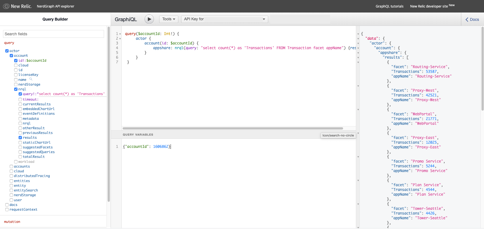
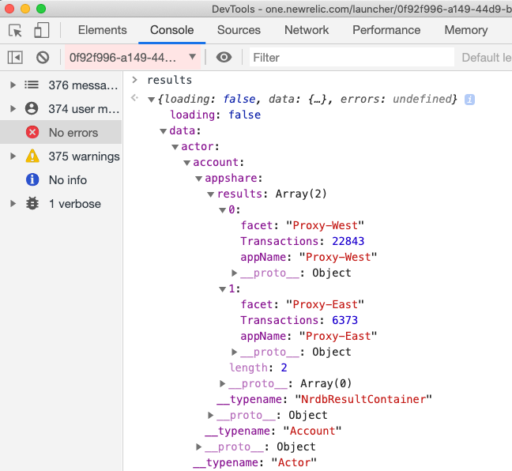
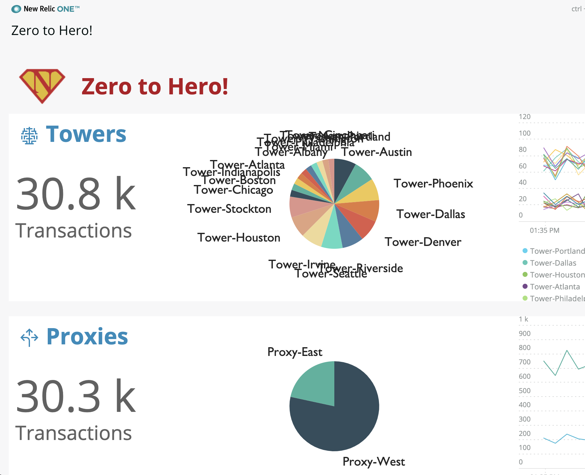
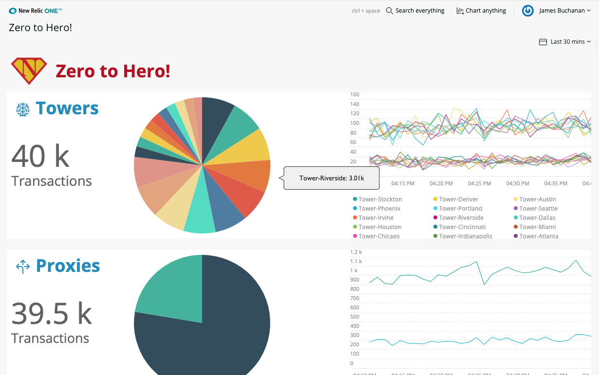

# Chapter 11 - Data Loading

In this chapter we learn how to load data from the New Relic graphQL API and use it to render the data in our custom pie chart component.


## 1. Component lifecyle methods

React components all have lifecycle methods that are triggered at various points of component mounting and rendering. Here is a top level summary:


> More information about this can be found on the [React website](https://reactjs.org/docs/react-component.html#mounting)


We've already been using the `render()` method. We now need to load our data, this should be triggered in the `componentDidMount()` method as we only want to load data once, not on every re-render. We'll see how we use `componentDidUpdate()` to manage updates when we do want to re-load data later.


## 2. Loading....

Loading of data is asynchronous, we don't want the application to stall whilst the data is loaded. The convention is to provide some sort of feedback to the user that something will happen soon. The NR1 component library has a [`<Spinner>`](https://developer.newrelic.com/client-side-sdk/index.html#components/Spinner) component just for this purpose.

We will store the loaded data in **state** which we explored in [chapter 8](../chapter-08). Until there is data loaded we want to show a loading spinner. Lets do that now:


Import the `<Spinner>` component at the top of `SimplePie.js`:

```jsx
import { Spinner } from `nr1`
```


We will set the default output of the `render()` method to be the spinner and override it if there is data. We need to add a constructor to the top of the class first to instantiate the state:

```jsx
constructor(props) {
    super(props)
    this.state = { data: null }
}
```


In the `render()` method we need to extract the data from state then if it has a value we return the pie chart otherwise we return the spinner. Here is the entire file:

```jsx
import { Component } from 'react'
import { VictoryPie } from 'victory'
import { Spinner } from 'nr1'

export default class SimplePie extends Component { 
    constructor(props) {
        super(props)
        this.state = { data:null }
    }

    render() {
        const { data } = this.state
        let returnVal = <Spinner />
        if(data) {
            returnVal=<VictoryPie height={200} colorScale="qualitative" 
                data={[
                    { x: "Cats", y: 35 },
                    { x: "Dogs", y: 40 },
                    { x: "Birds", y: 55 }
                ]}
            />
        }
        return returnVal
    }
}
```

> We test that `(this.state.)data` has a value, if so we show the chart else we show the spinner.


Save the files and you should now see a spinner where the pie chart used to be:




## 3. Loading data

We need to load the data from the New Relic graphql API and then update the state with it. But first lets just test the state update mechanism with some sample data:

### 3a. Testing data load and state change

We need to use the `componentDidMount()` method from the React lifecycle methods. Add the following code after the constructor:

```jsx
  async componentDidMount() {
      this.loadData()
  }

  loadData() {
      let exampleData=[
          { x: "Potatoes", y: 35 },
          { x: "Carrots", y: 40 },
          { x: "Parsnips", y: 55 }
      ]
      this.setState({ data: exampleData})
  }
```

> Here we create a method called `loadData()` which will do the acutal data load and we call it from the `compoenrDidMount()` method. Currently the load method sets the state with a hard coded example object.


Amend the `<VictoryPie>` component to use the **data** variable extracted from state rather than the previous dogs/cats example data:

```jsx
if(data) {
    returnVal=<VictoryPie height={200} colorScale="qualitative" data={data} />
}
```


Save the changes and you should observe that the pie chart appears almost instantaneously (it didnt take long to load that example data!):




### 3b. Exploring graphQL API

We will be using the New Relic graphQL API. We can test our queries first by using the [NerdGraph API Explorer tool](https://api.newrelic.com/graphiql). Explaining how to use this is beyond the scope of this toturial but lets quickly try out a query:

In the middle query window of the [tool](https://api.newrelic.com/graphiql) enter the following graphQL query:

```graphql
query($accountId: Int!) {
    actor {
        account(id: $accountId) {
            appshare: nrql(query: "select count(*) as 'Transactions' FROM Transaction facet appName") {results}
        }
    }
}
```


And in the variables window we need to specify our account id like this:

```
{"accountId": 1}
```

> A quick attempt at explanation: The graphQL query is specifying that we want the results of an **nrql** query. We label that query "**appshare**" (we could have called it whatever we liked, its just our own label). In order to request an nrql query we need to be within the context of an **account** (which we supply the id of) and ultimately within an **actor** context.


When you press the play button you should get a response in the right hand side window:




Observe that the **data** attribute of the response object reflects the structure of our query:

```json
"data": {
    "actor": {
      "account": {
        "appshare": {
          "results": [
            {
              "facet": "Routing-Service",
              "Transactions": 53587,
              "appName": "Routing-Service"
            },
            {
              "facet": "Proxy-West",
              "Transactions": 42521,
              "appName": "Proxy-West"
            },
            {
              "facet": "WebPortal",
              "Transactions": 21771,
              "appName": "WebPortal"
            },
            {
              "facet": "Proxy-East",
              "Transactions": 12025,
              "appName": "Proxy-East"
            },
            {
              "facet": "Promo Service",
              "Transactions": 5244,
              "appName": "Promo Service"
            },
            {
              "facet": "Plan Service",
              "Transactions": 4544,
              "appName": "Plan Service"
            },
            {
              "facet": "Tower-Seattle",
              "Transactions": 4426,
              "appName": "Tower-Seattle"
            },
            {
              "facet": "Tower-Portland",
              "Transactions": 4352,
              "appName": "Tower-Portland"
            },
            {
              "facet": "Tower-Denver",
              "Transactions": 4339,
              "appName": "Tower-Denver"
            },
            {
              "facet": "Tower-Austin",
              "Transactions": 4316,
              "appName": "Tower-Austin"
            }
          ]
        }
      }
    }
  }
```


We will use this query (with some adjustments) in our application.


### 3c. Loading data with `NerdGraphQuery`

We will retrieve data from New Relic using the [NerdGrpahQuery component](https://developer.newrelic.com/client-side-sdk/index.html#data-fetching/NerdGraphQuery) from the component library. This allows us to construct and send a [graphQL](https://graphql.org/) query to the API and receive a response back.


We need to pass some props through from the ChartRow component into the SimplePie component.  Update the reference in the ChartRow  `index.js` as follows:

```jsx
<SimplePie accountId={accountId} likeClause={row.likeClause} sinceClause={sinceClause}/>
```


In `SimplePie.js` Import the NerdGraphQuery component:

```jsx
import { Spinner, NerdGraphQuery } from 'nr1'
```


Change the `loadData()` method as follows:

```jsx
loadData() {
    const { accountId, likeClause, sinceClause } = this.props

    const variables = {
        id: accountId
    }

    let query = `
        query($id: Int!) {
            actor {
                account(id: $id) {
                    appshare: nrql(query: "select count(*) as 'Transactions' FROM Transaction where appName like '${likeClause}' facet appName limit max ${sinceClause}") {results}
                }
            }
        }
    `

    const q = NerdGraphQuery.query({ query: query, variables: variables });
    q.then(results => {
        debugger
    }).catch((error) => { console.log(error); })
}
```

> First we extract the account ID, like clause and since clause from props. We then define a variable called **variables** that contains the account ID and also define variable called **query** that holds the graphQL query. These two variables are passed as arguments to the `NerdGraphQuery.query()` method. When it receives a response the `.then()` method fires and the debugger is triggered.


Save the files and the debugger should pause at the correct place (Reload the page if its not working). In the console enter the word `results` and press return, you should see a result like the following:




We can see here that the object `data.actor.account.appshare.results` is an array. In this case it has two elements. Each element has the attributes: `facet`, `Transactions` and `appName`. The pie chart component will not understand this so we need to construct an object to pass to the pie chart component that is of this format:

```json
[
    { x: "Proxy-West", y: 22843 },
    { x: "Proxy-East", y: 6373 }
]
```


Replace the `q.then()` with the following code that formats the data how we need using a `.map()`  and sets the state with it:

```jsx
  q.then(results => {
      const formattedData=results.data.actor.account.appshare.results.map((item)=>{ return { x: item.appName, y: item.Transactions } })
      console.log("formattedData",formattedData)
      this.setState({data: formattedData})
  }).catch((error) => { console.log(error); })
```

> Notice that we have left a `console.log()` in there so you can see the data being generated in the console.


Save the changes and it should look a bit like this:




**Note: You may notice that the time picker is no longer affecting the pie chart. We will deal with that in the next chapter.**


## 4. Tidy up

Its looking a little crowded. In hindsight maybe this example of whole pie chart with floaty labels was a bad idea! Nevermind, lets fix it best we can.


We'll remove the labels and enable tool tips. Add the import for the `<VictoryTooltip>` and `<VictoryContainer>`at the top of the file:

```jsx
import { VictoryPie, VictoryTooltip, VictoryContainer } from 'victory'
```


Where we process the results of the NerdGraphQuery change the definition of `formattedData` so that a **label** attribute is now included:

```jsx
const formattedData=results.data.actor.account.appshare.results.map((item,idx)=>{ 
    return {  
        y: item.Transactions, 
        label: `${item.appName}: ${Number(item.Transactions/1024).toFixed(2)}k` 
    } 
})
```

> We dont acutally need the 'x' attribute anymore so its been removed


Finally amend the `<VictoryPie>` component attributes to specify less padding and enable the tooltip like this:

```jsx
returnVal=<VictoryPie 
    height={300} 
    colorScale="qualitative" 
    data={data} 
    padding={10}
    labelComponent={<VictoryTooltip/>}
    containerComponent={<VictoryContainer responsive={false}/>}
/>
```


Ok, so it's still a bit janky looking but it will do. Save all the files and check everything still works *(the time picker won't, yet)*:




Here is the full `SimplePie.js`file: (also in [/code](./code))

```jsx
import { Component } from 'react'
import { VictoryPie, VictoryTooltip, VictoryContainer } from 'victory'
import { Spinner, NerdGraphQuery } from 'nr1'

export default class SimplePie extends Component { 
    constructor(props) {
        super(props)
        this.state = { data:null }
    }

    async componentDidMount() {
        this.loadData()
    }
    
    loadData() {
        const { accountId, likeClause, sinceClause } = this.props

        const variables = {
            id: accountId
        }

        let query = `
            query($id: Int!) {
                actor {
                    account(id: $id) {
                        appshare: nrql(query: "select count(*) as 'Transactions' FROM Transaction where appName like '${likeClause}' facet appName limit max ${sinceClause}") {results}
                    }
                }
            }
        `

        const q = NerdGraphQuery.query({ query: query, variables: variables });
        q.then(results => {
            const formattedData=results.data.actor.account.appshare.results.map((item,idx)=>{ 
                return {  
                    y: item.Transactions, 
                    label: `${item.appName}: ${Number(item.Transactions/1024).toFixed(2)}k` 
                } 
            })
            this.setState({data: formattedData})
        }).catch((error) => { console.log(error); })
    }

    render() {
        const { data } = this.state
        let returnVal = <Spinner />
        if(data) {
            returnVal=<VictoryPie 
                height={300} 
                colorScale="qualitative" 
                data={data} 
                padding={10}
                labelComponent={<VictoryTooltip/>}
                containerComponent={<VictoryContainer responsive={false}/>}
            />
        }
        return returnVal
    }
}
```


---

[Continue to Chapter 12](../chapter-12)


**FEEDBACK!**

Please provide feedback about this chapter or the course in general via email (jbuchanan@newrelic.com) a **pull request** or via the [feedback form](https://forms.gle/STjad8z2YkdzwAWJA).