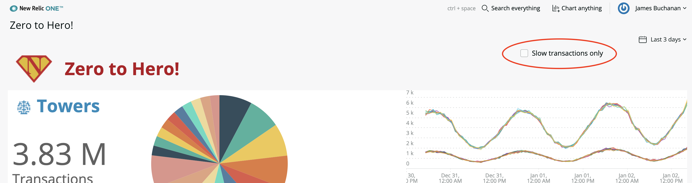
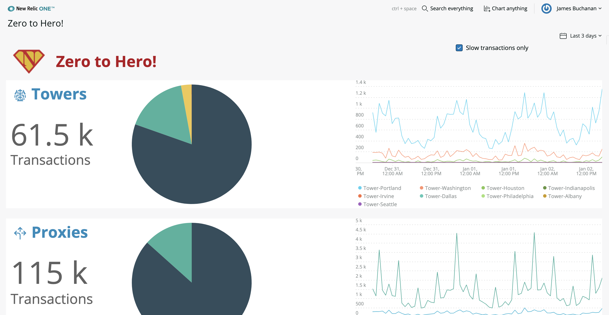

# Chapter 12 - Reacting to user interaction

In this chapter we fix the time picker for the pie chart and explore handling other user interactions and how they get propagated through the component hierarchy.


## 1. Reacting to changes to props

The pie chart no longer changes when the time picker is adjusted. This is because we only load the data when the component is mounted in `componentDidMount()`. We do not necessarily want to re-load the data when properties change. In our case we only want to reload the data when the **sinceClause** prop changes.

> Why not reload on any property change? Well, lets say one of the properties was a color property. We might have a button on the app that when pressed changes the color of our component.  The property 'color' would change, that doesnt mean we need to reload the data, just change the color.


### 1a. Detect sinceClause changes

When the properties change we need to make a decision as to whether to re-load the data. The component lifecycle method `componentDidUpdate()` is called whenever the properties or state change. This is where we can attach our logic to test for a change in the **sinceClause**.

Add the following code *after* the `componentDidMount()` method:

```jsx
componentDidUpdate(prevProps) {
    if (prevProps.sinceClause!==this.props.sinceClause ){
       this.loadData()
    }
}
```

> This compares the previous props (available in `prevProps`) with the current props (in `this.props`). If they are different a data reload is triggered.


### 1b. User feedback whilst loading

When the pie chart data is reloading we might want to indicate this to the user. Currently the chart only updates when new data is received. Lets show the spinner until the data is received by resetting the `this.state.data` when we update:

```jsx
componentDidUpdate(prevProps) {
    if (prevProps.sinceClause!==this.props.sinceClause ){
        this.setState({ data: null})
       this.loadData()
    }
}
```

> Now when you change the time picker the pie chart should vanish, replaced by the spinner until data is received. This may or may not be what you want, its down to personal taste and context ;)


## 2. Custom user interaction

Lets add a custom control that allows the user indicate that only slow transactions should be included in the data.

### 2a. Adding the control

We can use a checkbox for this simple control. The [`<Checkbox>`](https://developer.newrelic.com/components/checkbox) component from the NR1 component library will do nicely.

In the main nerdlet `index.js` file change the frist `<Grid>` into three columns by adding a new `<GridItem>` and setting the columnSpan's to 1, 8 and 3.

```jsx
<Grid>
    <GridItem columnSpan={1} className="AppIcon"></GridItem>
    <GridItem columnSpan={8}>
        <HeadingText 
            tagType={HeadingText.TAG_TYPE.H1}
            className="MainHeading"
        >
            Zero to Hero!
        </HeadingText>
    </GridItem>
    <GridItem columnSpan={3}>
        !!!! Checkbox will go here !!!!
    </GridItem>
</Grid>
```


Import the `<Checkbox>` component from NR1 in the import:

```jsx
import { Grid, GridItem, HeadingText, Icon, PlatformStateContext, Checkbox } from 'nr1'
```


Add the component to the new `<GridItem>`:

```jsx
<GridItem columnSpan={3}>
    <Checkbox label='Slow transactions only' />
</GridItem>
```


Check the application renders, you should see the checkbox in the top right:




### 2b. Changing state when checked

We need to use state to manage whether only slow transactions are shown. Changing the value of the checkbox should change the value in state.

First, we need to initialise the state. Add a constructor to the main class in `index.js`, right at the top that defines a state variable `slowOnly`:

```jsx
export default class ZerotoheroNerdlet extends React.Component {
	constructor(props) {
      super(props)
      this.state = { slowOnly: false }
  }
  ...
```


Just after where rows is defined add the following handler for the checkbox state change: 

```jsx
const slowToggle = (event) => {
    this.setState({ slowOnly: event.target.checked})
}
```

> We can tell if the checkbox is checked by checking the `event.target.checked` property. Here we simply set the state to true if its checked.


Finally we need to connect the `onChange` handler to the checkbox so that it triggers the state change when its changed by the user:

```jsx
<Checkbox onChange={slowToggle} label='Slow transactions only' />
```


### 2c. Reacting to the state change

We need the three charts to change when the state `slowOnly`changes. The basic charts will do this automatically when the query changes, so we just need to add a restriction to their query prop when the checkbox is checked.  

At the top of of `<PlatformStateContext.Consumer>` extract the `slowOnly` value from `this.state` by destructuring:

```jsx
return <PlatformStateContext.Consumer>
    {(platformUrlState) => {

        const {slowOnly } = this.state

        let sinceClause = ""...
```


Add a new attribute to `<ChartRow>` to pass a `duration` prop value through to our ChartRow component:

```jsx
return <ChartRow key={index} row={row} accountId={accountId} sinceClause={sinceClause} uniqueId={index} duration={slowOnly ? 0.5 : 0}/>
```

> We are defining that if the check box is checked then we want to show only transactions that are longer than 0.5 seconds, otherwise 0 seconds is the threshold.

Now in the `index.js` of the custom component ChartRow add the new attribute as a property to the PropTypes:

```jsx
static propTypes = {
    row: PropTypes.object.isRequired,
    accountId: PropTypes.number.isRequired,
    sinceClause: PropTypes.string,
    duration: PropTypes.number.isRequired
 }
```


Extract the new prop **duration** from `this.props`:

```jsx
const { row, accountId, sinceClause, duration } = this.props
```


Now append each of the queries on the `<BillboardChart>` and `<LineChart>` to include a where clause filtering on duration by adding ` ... where duration >= ${duration}`  like this:

```jsx
<BillboardChart 
    accountId={accountId}
    query={`select count(*) as 'Transactions' FROM Transaction where appName like '${row.likeClause}' ${sinceClause}  where duration >= ${duration}`}
    fullWidth
/>
```

```jsx
<LineChart
    accountId={accountId}
    query={`select count(*) as 'Transactions' FROM Transaction where appName like '${row.likeClause}' facet appName limit max timeseries ${sinceClause} where duration >= ${duration}`}
    fullWidth
    fullHeight
/>
```


Add duration as a property on `<SimplePie>`:

```jsx
<SimplePie accountId={accountId} likeClause={row.likeClause} sinceClause={sinceClause} duration={duration}/>
```


In `SimplePie.js` we need to do a little more. First extract from `this.props` and append the query:

```jsx
const { accountId, likeClause, sinceClause, duration } = this.props
```

```jsx
let query = `
    query($id: Int!) {
        actor {
            account(id: $id) {
                appshare: nrql(query: "select count(*) as 'Transactions' FROM Transaction where appName like '${likeClause}' facet appName limit max ${sinceClause} where duration >= ${duration}" ) {results}
            }
        }
    }
`
```


Finally, we need to specify that a change to the **duration** property should cause the component to reload data. We need to change the logic in `componentDidUpdate()` to look out for this like follows:

```jsx
componentDidUpdate(prevProps) {
      if (prevProps.sinceClause!==this.props.sinceClause ||
          prevProps.duration!==this.props.duration
          ){
          this.setState({ data: null})
          this.loadData()
      }
  }
```


That was a lot of changes, but if followed along your application should now update all the charts when the checkbox is toggled. Rememebr the source code can be found in [/code](./code) if you get stuck.


### 2d. Change the default

What if we want the default to be slow transactions? (i.e. have the check box checked by default) Well thats easy, because the toggle state is stored in `this.state.slowOnly` we can simply apply that value to the `defaultChecked` property of the `<Checkbox>` and set it to true in our initialisation within the constructor:

```jsx
constructor(props) {
    super(props)
    this.state = { slowOnly: true }
}
```

```jsx
<Checkbox onChange={slowToggle} defaultChecked={slowOnly} label='Slow transactions only' />
```




---

**Course complete!** Thanks for getting to the end, I hope you now feel empowered to build your own custom applications and teach others too. Please do provide some feedback, I would really appreciate it.


**Bonus Chapters**

The bonus chapters build upon what we've already created to look at further features and techniques

[Continue to Bonus Chapter 13](../chapter-13)


**FEEDBACK!**

Please provide feedback about this chapter or the course in general via email (jbuchanan@newrelic.com) a **pull request** or via the [feedback form](https://forms.gle/STjad8z2YkdzwAWJA).