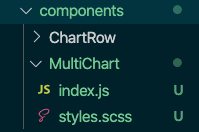
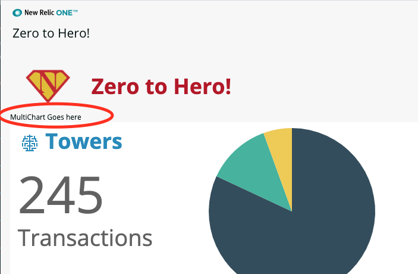
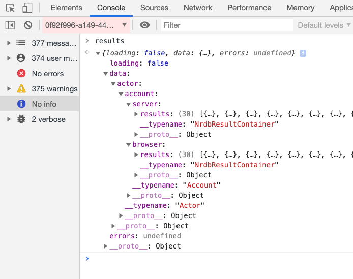
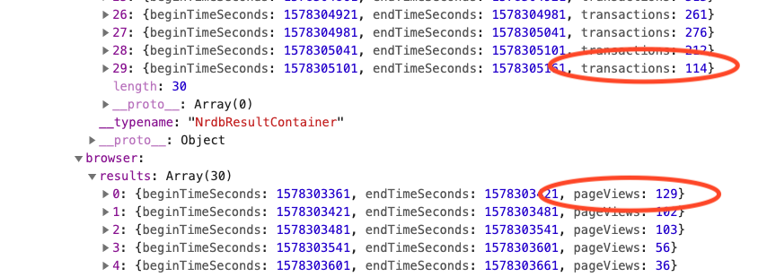
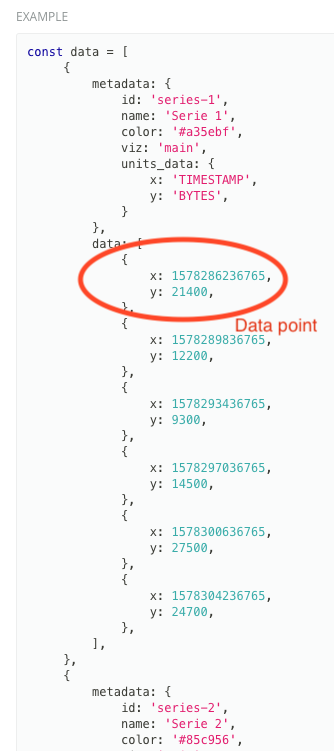
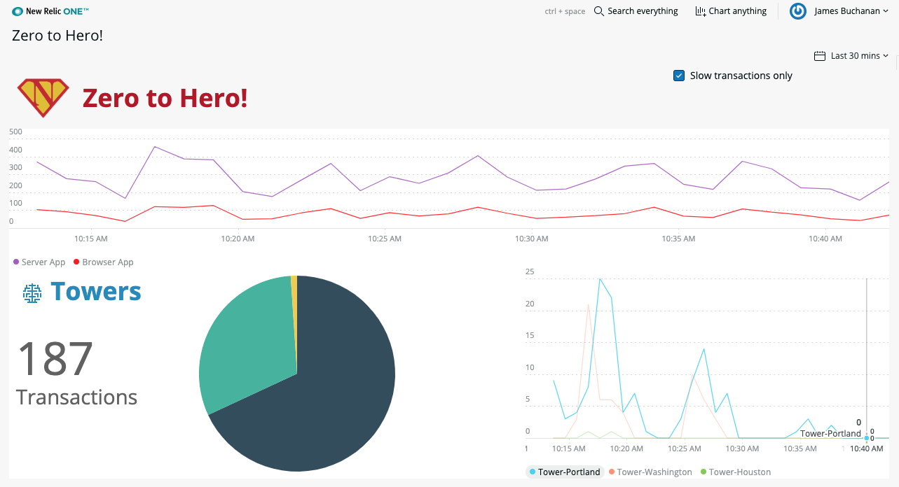

# Chapter 13 - Custom chart data

In this chapter we look at how to load data and hydrate an NR1 chart component using custom data. We also look at how to auto-refresh the chart.


## 1. Create the component

We will create a standalone component for this functionality and drop it into the top of our application.  Lets stub out the component then get into the details. This should be familiar from chapter 8:

Create a new sub folder within the `/components` folder called "MultiChart" and within that create an empty `index.js` and `styles.scss` file.index.js




Add the following boiler plate code to `index.js`:

```jsx
import { Component } from 'react';

export default class MultiChart extends Component { 
    render() {
        return <div>MultiChart Goes here</div>
    }
}
```


In the main nerdlet `index.js` add the import to the top of the file and in the render add the component in a new `<Grid>` row just before `{rows}`:

```jsx
import MultiChart from '../../components/MultiChart'
```

```jsx
...
</Grid>
  <Grid>
      <GridItem columnSpan={12}>
          <MultiChart />
      </GridItem>
  </Grid>
{rows}
...
```


Add the import to the `styles.scss`:

```jsx
@import '../../components/MultiChart/styles.scss';
```


Save all the files and check that the component is appearing:




## 2. Load the chart data

We covered loading data from the graphQL API in [chapter-11](../chapters/chapter-11). We will follow the same pattern here, refer to that chapter for more detials.

### 2a. Load the data

Import the components we will need:

```jsx
import PropTypes from 'prop-types';
import { Spinner, NerdGraphQuery, LineChart } from 'nr1'
```


Add a some propTypes, constructor, `loadData()` and `componentDidMount()`method to the MultiChart component, before the `render()` method:

```jsx
static propTypes = {
    accountId: PropTypes.number.isRequired,
    sinceClause: PropTypes.string
 }

constructor(props) {
    super(props)
    this.state = { data:null }
}

async componentDidMount() {
	this.loadData()
}

loadData() {
    const { accountId, sinceClause } = this.props

    const variables = {
        id: accountId
    }

    let query = `
        query($id: Int!) {
            actor {
                account(id: $id) {
                    server: nrql(query: "SELECT count(*) as 'transactions' from Transaction where appName='WebPortal' timeseries ${sinceClause}") {results}
                    browser: nrql(query: "select count(*) as 'pageViews' FROM PageView where appName='WebPortal' timeseries ${sinceClause}") {results}
                }
            }
        }
    `

    const q = NerdGraphQuery.query({ query: query, variables: variables });
    q.then(results => {
        debugger
    }).catch((error) => { console.log(error); })
}

```

> Notice that we make two *different* nrql queries in this single graphQL request, we will plot the results of both on the same chart. You will need to make sure you provide queries that return similar data.


Update the `render()` method to show the spinner whilst the data loads:

```jsx
render() {
    const { data } = this.state
    let returnVal = <Spinner />
    if(data) {
        returnVal=<div>MultiChart Goes here</div>
    }
    return returnVal
}
```


In the main nerdlet `index.js` update the reference to the componenet to pass through the required attributes:

```jsx
<Grid>
    <GridItem columnSpan={12}>
        <MultiChart accountId={accountId} sinceClause={sinceClause}/>
    </GridItem>
</Grid>
```


Save all the files and you should see the spinner showing and the debugger pause execution when the results are loaded. 


### 1b. Format the data

Lets take a look at this data returned in the console by looking at the contents of the `results` variable:





We can see the data is returned in two parts`data.actor.account.browser` and `data.actor.account.server` This is how we requested it in our graphQL query!  Within each of these is a `results` array containing an object for each data point. Also, notice that the value is returned in different attributes `transactions` and `pageViews` because we named the fields differently in our queries.


The [example in the documentation](https://developer.newrelic.com/client-side-sdk/index.html#charts/LineChart) shows how custom data should be passed to the `<LineChart>` component. The data attribute is an array of objects, each object is a point on the chart specified as x (time data) and y (transactions) data. There is also meta data describing how the series of data should be formatted.



So we need to transform our results into the format  as per the example. Its quite straightforward. **Try to do this yourself** by replacing the `debugger` with a `this.setState({ data: your-formatted-data-here})`

This is my solution, I chose to use the `endTimeSeconds` as the x value and have created a formatting funciton so that we can easily add more queries later:

```jsx
q.then(results => {

    const dataFormatter = (data, fieldName, id, name, color) =>{
        return {
            metadata: {
                id: id,
                name: name,
                color: color,
                viz: 'main',
                units_data: {
                    x: 'TIMESTAMP',
                    y: 'TRANSACTIONS',
                }
            },
            data: data.results.map((datapoint)=>{ return { x: datapoint.endTimeSeconds*1000, y:datapoint[fieldName] }})
        }
    }

    let formattedData=[]
    formattedData.push(dataFormatter(results.data.actor.account.server,'transactions','series1','Server App', '#a35ebf'))
    formattedData.push(dataFormatter(results.data.actor.account.browser,'pageViews','series2','Browser App', '#ff0000'))
    this.setState({data: formattedData})

}).catch((error) => { console.log(error); })
```


Now the data is loaded we can pass it to a chart component:

```jsx
<MultiChart accountId={accountId} sinceClause={sinceClause}/>
```


Hopefully your application should be rendering something like this:



> If your X axis time range is wrong then make sure you have multiplied  the `endTimeBeginSeconds` by 1000 as the chart expects millisecond timestamps!


**Alternative data loading method:**

Theres more than one way to skin a cat. The above method uses graphql to query the data and then we learn to format it for the chart. However there are some components that make this a little simpler. Explore the [`<NrqlQuery>`](https://developer.newrelic.com/client-side-sdk/index.html#data-fetching/NrqlQuery) component in the compnent library for a simpler method for single queries. This is also used in the [workshop lab 7](https://github.com/newrelic/nr1-workshop/blob/master/lab7/INSTRUCTIONS.md)


### 1c. Connecting the time picker

The chart doesnt respond to the time picker or slow transactions check box. We'll only connect up the time picker for this chart (feel free to connect up the check box if you like!).

This is easy, simply add a `componentDidUpdate()` method just before the `loadData()` method. This should be familiar as we did the same with the `<SimplePie>` component:

```jsx
componentDidUpdate(prevProps) {
    if (prevProps.sinceClause!==this.props.sinceClause){
        this.loadData()
    }
}
```


### 1d. Layout tidy

Lets add some spacing beneath the chart to make it look a little better.

In the main nerdlet `index.js` add a className attribute to the `<Grid>` containing the MultiChart component

```jsx
<Grid className="MultiChartRow">
```


Add the folllowing class to the `styles.scss`:

```jsx
.MultiChartRow {
    margin-bottom: 2em;
}
```


### 1e. Auto refresh the chart

You might notice that the other chart components occasionally auto-update and re-draw. Lets mimic this behaviour for our own component by making it reload data every minute.

The process is simple. In the `componentDidMount()` we need to create an interval timer that fires every minute to call the `loadData()` method. We also need to remember to cancel this timer when the component is removed which is handled by the `componentWillUnmount()` lifecycle method:

```jsx
async componentDidMount() {
    this.loadData()
    this.autoRefresh = setInterval(() => this.loadData(), 1000*60*1) //auto refresh 1 minute;
}

componentWillUnmount() {
    clearInterval(this.autoRefresh);
}
```


You should now see the chart updating every minute.


---

Here is the entire component file:

```jsx
import { Component } from 'react';
import PropTypes from 'prop-types';
import { Spinner, NerdGraphQuery, LineChart } from 'nr1'

export default class MultiChart extends Component { 
    static propTypes = {
        accountId: PropTypes.number.isRequired,
        sinceClause: PropTypes.string
     }

    constructor(props) {
        super(props)
        this.state = { data:null }
    }

    async componentDidMount() {
        this.loadData()
        this.autoRefresh = setInterval(() => this.loadData(), 1000*60*1) //auto refresh 1 minute;
    }

    componentWillUnmount() {
        clearInterval(this.autoRefresh);
    }

    componentDidUpdate(prevProps) {
        if (prevProps.sinceClause!==this.props.sinceClause){
            this.loadData()
        }
    }

    loadData() {
        const { accountId, sinceClause } = this.props
    
        const variables = {
            id: accountId
        }
    
        let query = `
            query($id: Int!) {
                actor {
                    account(id: $id) {
                        server: nrql(query: "SELECT count(*) as 'transactions' from Transaction where appName='WebPortal' timeseries ${sinceClause}") {results}
                        browser: nrql(query: "select count(*) as 'pageViews' FROM PageView where appName='WebPortal' timeseries ${sinceClause}") {results}
                    }
                }
            }
        `
    
        const q = NerdGraphQuery.query({ query: query, variables: variables });
        q.then(results => {

            const dataFormatter = (data, fieldName, id, name, color) =>{
                return {
                    metadata: {
                        id: id,
                        name: name,
                        color: color,
                        viz: 'main',
                        units_data: {
                            x: 'TIMESTAMP',
                            y: 'TRANSACTIONS',
                        }
                    },
                    data: data.results.map((datapoint)=>{ return { x: datapoint.endTimeSeconds*1000, y:datapoint[fieldName] }})
                }
            }

            let formattedData=[]
            formattedData.push(dataFormatter(results.data.actor.account.server,'transactions','series1','Server App', '#a35ebf'))
            formattedData.push(dataFormatter(results.data.actor.account.browser,'pageViews','series2','Browser App', '#ff0000'))
            this.setState({data: formattedData})

        }).catch((error) => { console.log(error); })
    }

    render() {
        const { data } = this.state
        let returnVal = <Spinner />
        if(data) {
            returnVal=<LineChart data={data} fullWidth />
        }
        return returnVal
    }
}
```


---

**FEEDBACK!**

Please provide feedback about this chapter or the course in general via email (jbuchanan@newrelic.com) a **pull request** or via the [feedback form](https://forms.gle/STjad8z2YkdzwAWJA).